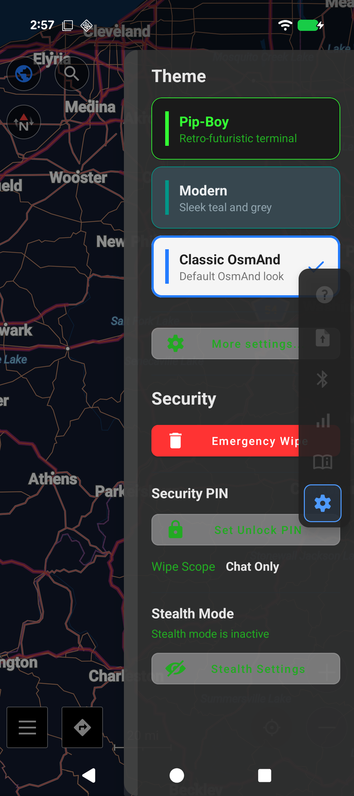
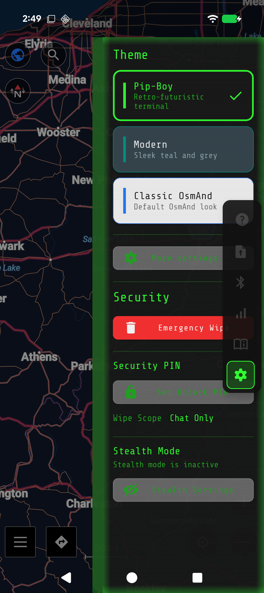
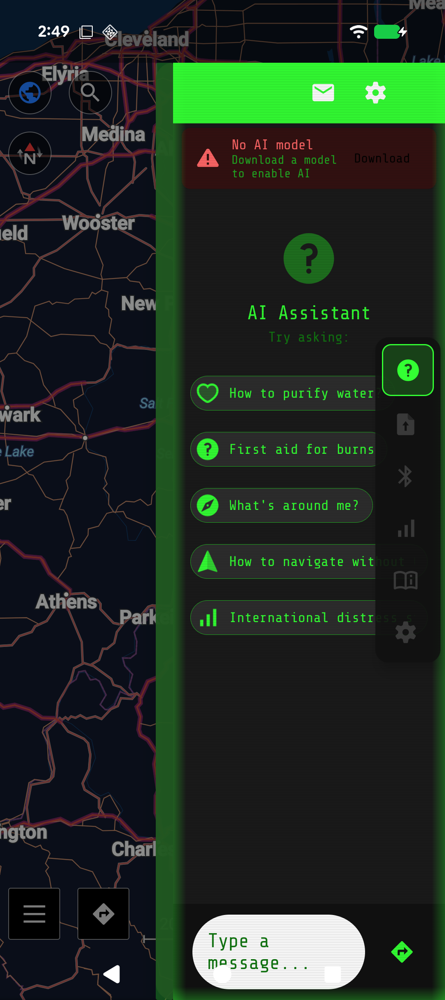
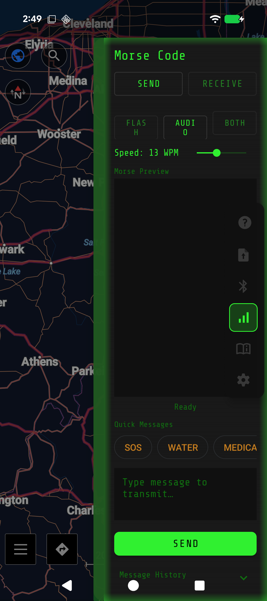

# 🔦 Rushlight

> **Offline field intelligence for Android.** AI assistant, encrypted P2P comms, offline Wikipedia, morse code, and navigation — all running locally on your phone with zero internet required.

[](LICENSE)
[](https://developer.android.com/about/versions/oreo)
[](https://github.com/liekzejaws/rushlight/releases)
[](https://github.com/osmandapp/OsmAnd)

Built for journalists, activists, humanitarian workers, and anyone who needs to operate in low-connectivity or high-surveillance environments. **No cloud. No accounts. No telemetry. Everything stays on your device.**

---

## 📸 Demo

[](https://youtube.com/shorts/-ursT48AsOs)

> *Click to watch the demo video*

<p align="center">
  
  
  
  
</p>

---

## ✨ What It Does

| Feature | Description |
|---------|-------------|
| 📌 **FieldNotes** | Shared map annotations that sync device-to-device — like Dark Souls messages for the real world. Pin notes to GPS coordinates (water sources, hazards, shelters, routes), sign them with ECDSA P-256, and let them propagate through the mesh. The on-device AI can query them: *"Is there water nearby?"* |
| 🤖 **Offline AI** | On-device LLM (llama.cpp) with RAG pipeline — asks questions, gets answers from offline Wikipedia, 26 field guides, and nearby FieldNotes. No internet ever. |
| 📡 **P2P Sharing** | BLE discovery + WiFi Direct transfer. Share maps, AI models, FieldNotes, and data device-to-device. ECDH + ChaCha20-Poly1305 encrypted. |
| 🗺️ **Navigation** | Full OsmAnd mapping stack — offline vector maps, turn-by-turn routing, POI search. |
| 📖 **Offline Wikipedia** | ZIM file reader with full-text search. The AI can cite Wikipedia in its responses. |
| 📚 **Field Guides** | 26 bundled guides across 11 categories: First Aid, Water, Fire, Shelter, Navigation, Signaling, Food, Security, Engineering, Automotive, Electrical. |
| 💡 **Morse Code** | Flashlight and audio transmission, camera/mic reception. AI-powered error correction. No accessories required. |
| 🛡️ **Security** | Duress PIN, panic wipe, stealth mode (hidden from launcher, accessible via dialer code), AES-256-GCM encrypted chat storage, ECDSA-signed FieldNotes. |
| 🎨 **Pip-Boy Skin** | Retro-futuristic green CRT terminal aesthetic. Because why not. |

---

## 📌 FieldNotes — Shared Map Annotations

FieldNotes is Rushlight's flagship feature: a **decentralized, cryptographically signed annotation system** for offline maps. Think of it as Dark Souls-style player messages, but for real-world field intelligence.

**How it works:**
1. Long-press the map to drop a note at any GPS coordinate
2. Choose a category (water, shelter, hazard, cache, route, medical, signal, intel)
3. Your note is signed with your device's ECDSA P-256 keypair and stored locally
4. When another Rushlight user comes within BLE/WiFi range, notes gossip between devices automatically
5. Notes accumulate confirmations as they propagate and can be upvoted/downvoted for trust scoring
6. The on-device AI can query notes spatially — ask *"what's nearby?"* and it reads the collective field intelligence

**Why it matters for the field:**
- **No infrastructure needed.** Notes sync peer-to-peer. No servers, no internet, no accounts.
- **Tamper-evident.** Every note carries a cryptographic signature. Recipients can verify the note hasn't been modified in transit.
- **Privacy-preserving.** Author identity is a public key hash — anonymous but unique and verifiable. Panic wipe generates a fresh identity.
- **Self-cleaning.** Notes expire after their TTL (default: 1 week). Stale intelligence is automatically purged.
- **AI-integrated.** The LLM can both read and write FieldNotes. Ask it a question about your surroundings and it queries the annotation database. Tell it about a hazard and it creates a note for others.

**Technical details:**

| Component | Implementation |
|-----------|---------------|
| Storage | SQLite with content-addressed IDs (SHA-256 of core fields) |
| Signing | ECDSA P-256, Android Keystore-backed keypairs |
| Sync | JSON gossip over BLE + WiFi Direct mesh |
| Spatial queries | Bounding-box SQL pre-filter + Haversine post-filter |
| Trust | Upvote/downvote scoring, confirmation counting across peers |
| LLM tools | `query_fieldnotes` and `create_fieldnote` wired into on-device AI |
| Categories | 8 types with distinct icons and colors on the map overlay |
| Expiry | TTL-based cleanup (CoT stale-event pattern from ATAK) |

---

## 🎯 Who It's For

- **Journalists** covering conflict zones or authoritarian regimes
- **Activists** operating under internet surveillance or shutdowns
- **Humanitarian workers** in disaster or infrastructure-degraded areas
- **Preppers / survivalists** who want genuine offline capability
- **Anyone** who thinks their phone should work without a data connection

---

## 🏗️ Architecture

```
User Query
    ↓
QueryClassifier (11 query types)
    ↓ (parallel search)
    ├── ZimSearchAdapter       → Offline Wikipedia
    ├── GuideSearchAdapter     → 26 bundled field guides
    ├── MapDataAdapter         → Nearby map POIs
    ├── PlaceSearch            → Named location lookup
    └── FieldNotes tools       → Nearby annotations from P2P mesh
    ↓
PromptBuilder (adaptive context blending)
    ↓
LlmManager → llama.cpp JNI → Streaming response
                                    ↓ (optional)
                            create_fieldnote → map pin for others

FieldNotes Sync:
Device A ──BLE/WiFi──→ Device B ──BLE/WiFi──→ Device C
   ↓ sign (ECDSA P-256)    ↓ verify + store       ↓ gossip forward
   ↓ store locally          ↓ increment confirms   ↓ vote up/down
```

**Core stack:**
- **OsmAnd** (Apache 2.0) — maps and navigation foundation
- **llama.cpp** — on-device LLM inference via JNI. Supports any GGUF model.
- **Kiwix ZIM** — offline Wikipedia reader
- **SQLCipher** — encrypted local storage
- **BLE + WiFi Direct** — zero-infrastructure P2P and FieldNotes gossip
- **ECDSA P-256** — FieldNote signing and author verification

---

## 🚀 Building

### Prerequisites
- Android Studio (Arctic Fox+) with Android SDK
- JDK 17 (bundled with Android Studio)
- Android 8.0+ device or emulator (AI requires Android 11+)
- ~16GB disk space

### Build
```bash
git clone https://github.com/liekzejaws/rushlight.git
cd rushlight

export JAVA_HOME="/path/to/Android Studio/jbr"

./gradlew assembleNightlyFreeLegacyArm64Debug
```

APK output:
```
OsmAnd/build/outputs/apk/nightlyFreeLegacyArm64/debug/OsmAnd-nightlyFree-legacy-arm64-debug.apk
```

### Install
```bash
adb install -r <path-to-apk>
adb shell am start -n io.rushlight.app/net.osmand.plus.activities.MapActivity
```

### First Run
1. App launches with Rushlight onboarding
2. Drop a GGUF model (e.g. Phi-3-mini Q4_K_M, ~2.3GB) into the models directory
3. Download a Wikipedia ZIM from [Kiwix](https://wiki.kiwix.org/wiki/Content)
4. Download offline maps via the built-in map manager
5. Ask it anything

---

## 🔒 Security Model

- **AES-256-GCM** encrypted chat storage via SQLCipher (Android Keystore-backed keys)
- **ECDH P-256 + ChaCha20-Poly1305** for all P2P transfers
- **ECDSA P-256** signing on all FieldNotes — tamper-evident, verifiable authorship
- **Duress PIN** — triggers configurable data wipe under coercion
- **Panic Wipe** — one-tap destruction of all sensitive data + signing keypair (fresh anonymous identity)
- **Stealth Mode** — hidden from launcher, accessible only via dialer code (`*#73784#`)
- **Zero telemetry** — no analytics, no crash reporting, no network callbacks
- **No accounts** — no registration, no cloud sync, nothing

---

## 🤝 Contributing

Rushlight is a solo project in active development. The core stack is working — what's needed now:

- **FieldNotes testing** — multi-device P2P sync, gossip propagation, signature verification across device types
- **FieldNotes categories** — what annotation types matter most in real field scenarios? Should we add custom categories?
- **Testing** on diverse Android hardware (especially mid-range and older devices)
- **Performance tuning** for LLM inference on constrained hardware
- **P2P stress testing** — how does FieldNotes gossip scale to 10+ devices?
- **Knowledge pack curation** — what field guide content is most valuable?
- **UI polish** — the Pip-Boy skin needs love
- **Accessibility** — screen readers, font scaling, high-contrast
- **Threat modeling** — review the FieldNotes crypto signing and P2P trust model

If you work in humanitarian tech, digital rights, mesh networking, or just think this is a cool problem — open an issue or PR. No formal process yet, just talk to me.

**Good first issues:** Check [Issues](https://github.com/liekzejaws/rushlight/issues).

---

## 📄 License

Rushlight additions are licensed under **AGPLv3**. The OsmAnd base is Apache 2.0. See [LICENSE](LICENSE) for details.

---

## 🙏 Built On

- [OsmAnd](https://osmand.net/) ([GitHub](https://github.com/osmandapp/OsmAnd)) — the offline maps foundation
- [llama.cpp](https://github.com/ggerganov/llama.cpp) — on-device LLM inference
- [Kiwix](https://kiwix.org/) — offline Wikipedia
- [Briar](https://briarproject.org/) — P2P architecture inspiration

---

*Rushlight is supported by grant applications to [NLnet Foundation](https://nlnet.nl/), [Open Technology Fund](https://www.opentech.fund/), and [Mozilla Foundation](https://foundation.mozilla.org/). If you use this in the field, I'd love to hear about it.*
